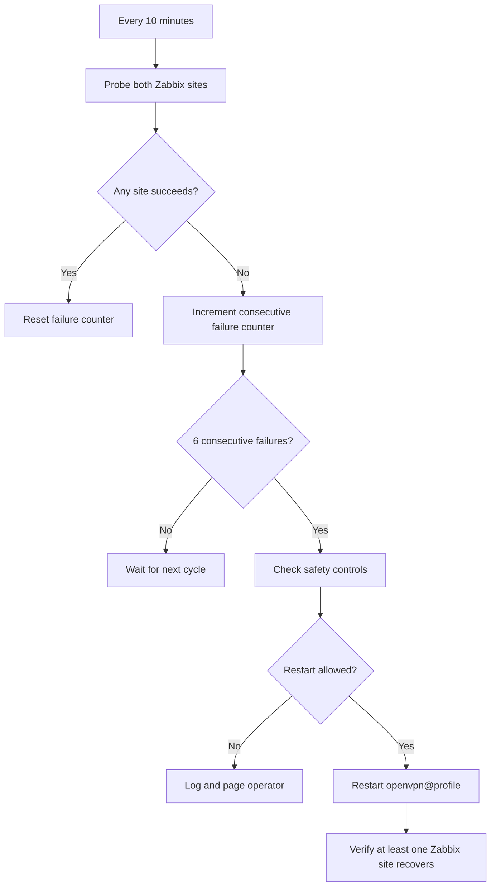

# Automatic OpenVPN Tunnel Recovery Procedure

Table of Contents (click to expand)

- [1. Executive Summary](#1-executive-summary)
- [2. Operating Assumption](#2-operating-assumption)
- [3. Trigger Conditions](#3-trigger-conditions)
  - [3.1 Probe Targets](#31-probe-targets)
  - [3.2 Failure Window](#32-failure-window)
  - [3.3 Reset Conditions](#33-reset-conditions)
- [4. OpenVPN Systemd Configuration](#4-openvpn-systemd-configuration)
- [5. Recovery Decision Flow](#5-recovery-decision-flow)
- [6. Operator Procedure](#6-operator-procedure)
  - [6.1 Pre-change Validation](#61-pre-change-validation)
  - [6.2 Manual Recovery](#62-manual-recovery)
  - [6.3 Post-recovery Verification](#63-post-recovery-verification)
- [7. Automation Design](#7-automation-design)
- [8. Safety Controls](#8-safety-controls)
- [9. Rollback Procedure](#9-rollback-procedure)
- [10. Open Questions and Future Scope](#10-open-questions-and-future-scope)


---

For the execution-level guide (Ansible role files, deployment commands from
the <deploy-server>, rollout procedure, rollback), see
`Implementation-OpenVPN-Tunnel-Recovery.md` (internal companion doc).

---

## 1. Executive Summary

This procedure defines how to detect and recover an OpenVPN tunnel failure when
Zabbix is reachable only through the tunnel. The recovery action is an OpenVPN
service restart, not a host reboot.

- Probe cadence: **10 minutes**.
- Probe targets:
  - `<zabbix-host>`
  - `<zabbix-host>`
- Trigger: **both** Zabbix targets fail continuously for **1 hour**.
- Required consecutive failed cycles: **6** (`1 hour / 10 minutes`).
- Recovery action: restart the relevant `openvpn@<profile>.service` instance.

The goal is to recover a stuck or unhealthy tunnel while avoiding false-positive
restarts during transient DNS, network, or single-site Zabbix incidents.

## 2. Operating Assumption

Zabbix access depends on an OpenVPN tunnel from the host. If the tunnel is up,
at least one of the two production Zabbix sites should be reachable. If both
sites are unreachable through repeated probe cycles, the local OpenVPN process
or tunnel state is considered a likely recovery candidate.

The OpenVPN unit already has `Restart=on-failure`, but a tunnel can become
unusable without the OpenVPN process exiting. This procedure covers that case by
probing application reachability and restarting the OpenVPN instance only after
a long, continuous failure window.

## 3. Trigger Conditions

### 3.1 Probe Targets

Probe four production Zabbix targets every 10 minutes: both proxy endpoints on
port **10051** and the same endpoints on port **10050**.

```yaml
probe_interval: 10m
probe_targets:
  - host: <zabbix-host>
    port: 10051
  - host: <zabbix-host>
    port: 10051
  - host: <zabbix-host>
    port: 10050
  - host: <zabbix-host>
    port: 10050
```

Default probe method:

1. Resolve the target hostname.
2. Attempt TCP connect to each configured host/port target.
3. Treat the probe as successful when the TCP connection succeeds.

### 3.2 Failure Window

A recovery is eligible only when all of the following are true:

- All configured probe targets fail in every probe cycle
(`<region>:10051`, `<region>:10051`, `<region>:10050`, `<region>:10050`).
- The failures are continuous for at least **1 hour**.
- No successful probe to either site occurred during the window.

At a 10-minute probe interval, this means:

```text
1 hour / 10 minutes = 6 consecutive failed cycles
```

### 3.3 Reset Conditions

The failure counter resets to zero when any of the following occurs:

- Either Zabbix target succeeds.
- An operator manually resets the monitor state.
- The monitor service is disabled through the kill-switch.
- The OpenVPN instance is intentionally stopped for maintenance.

## 4. OpenVPN Systemd Configuration

The host uses the templated OpenVPN systemd unit below. The instance name maps
to `/etc/openvpn/<profile>.conf`. For example, `openvpn@zabbix.service` uses
`/etc/openvpn/zabbix.conf`.

```ini
# From new 22.04 install
[Unit]
Description=OpenVPN connection to %i
PartOf=openvpn.service
ReloadPropagatedFrom=openvpn.service
Before=systemd-user-sessions.service
After=network-online.target
Wants=network-online.target
Documentation=man:openvpn(8)
Documentation=https://community.openvpn.net/openvpn/wiki/Openvpn24ManPage
Documentation=https://community.openvpn.net/openvpn/wiki/HOWTO

[Service]
Type=notify
PrivateTmp=true
WorkingDirectory=/etc/openvpn
ExecStart=/usr/sbin/openvpn --daemon ovpn-%i --status /run/openvpn/%i.status 10 --cd /etc/openvpn --script-security 2 --config /etc/openvpn/%i.conf --writepid /run/openvpn/%i.pid
PIDFile=/run/openvpn/%i.pid
KillMode=process
ExecReload=/bin/kill -HUP $MAINPID
CapabilityBoundingSet=CAP_IPC_LOCK CAP_NET_ADMIN CAP_NET_BIND_SERVICE CAP_NET_RAW CAP_SETGID CAP_SETUID CAP_SYS_CHROOT CAP_DAC_OVERRIDE CAP_AUDIT_WRITE
LimitNPROC=10
DeviceAllow=/dev/null rw
DeviceAllow=/dev/net/tun rw
ProtectSystem=true
ProtectHome=true
RestartSec=5s
Restart=on-failure

[Install]
WantedBy=multi-user.target
```

The recovery procedure should restart only the OpenVPN instance that owns the
Zabbix tunnel:

```bash
sudo systemctl restart openvpn@<profile>.service
```

Do not restart the host as part of this procedure.

## 5. Recovery Decision Flow




## 6. Operator Procedure

### 6.1 Pre-change Validation

Before enabling automation on a host, confirm the OpenVPN instance name and
baseline reachability:

```bash
systemctl list-units 'openvpn@*.service'
systemctl status openvpn@<profile>.service

getent hosts <zabbix-host>
getent hosts <zabbix-host>

nc -vz <zabbix-host> 10051
nc -vz <zabbix-host> 10051
# Optional when inventory includes internal probes:
nc -vz <zabbix-host> 10050
nc -vz <zabbix-host> 10050
```

If `nc` is not available, use the locally approved TCP probe tool.

### 6.2 Manual Recovery

If both sites are unreachable and the failure has persisted long enough to
suspect tunnel state, restart the OpenVPN instance:

```bash
sudo systemctl restart openvpn@<profile>.service
sleep 10
sudo systemctl status openvpn@<profile>.service
```

Check the OpenVPN status file and journal:

```bash
sudo ls -l /run/openvpn/
sudo journalctl -u openvpn@<profile>.service --since "30 minutes ago" --no-pager
```

### 6.3 Post-recovery Verification

After restart, verify that at least one Zabbix site is reachable:

```bash
nc -vz <zabbix-host> 10051
nc -vz <zabbix-host> 10051
# Optional when inventory includes internal probes:
nc -vz <zabbix-host> 10050
nc -vz <zabbix-host> 10050
```

Record the following in the incident notes:

- Hostname.
- OpenVPN profile name.
- First failed probe timestamp.
- Restart timestamp.
- Which Zabbix target recovered first.
- Any relevant journal lines from `openvpn@<profile>.service`.

## 7. Automation Design

The automation is shipped as the Ansible role `openvpn-zabbix-monitor`,
deployed through the existing `deploy.sh` wrapper from the <deploy-server>. The
on-host shape is a small bash script invoked by a systemd timer:

- `openvpn-zabbix-monitor.timer` — fires every 10 minutes
(`OnUnitActiveSec=10min`).
- `openvpn-zabbix-monitor.service` — `Type=oneshot`. Runs one probe cycle,
updates the on-host state, and (if eligible) restarts the OpenVPN tunnel.
- `/usr/local/bin/openvpn-zabbix-monitor` — the rendered probe + restart
script.
- State directory: `/var/lib/COMPANY/openvpn-zabbix-monitor/`. The state
file is `state` (shell-sourceable `KEY=VALUE`, not JSON). It tracks the
consecutive-failure counter, the last restart timestamp, and a comma-
separated restart history used by the restart budget.
- Config directory: `/etc/openvpn/openvpn-zabbix-monitor/`.
- Kill-switch: `/etc/openvpn/openvpn-zabbix-monitor/DISABLE`.
- Logs: each probe cycle emits `logger -t openvpn-zabbix-monitor ...`
lines, viewable via `journalctl -t openvpn-zabbix-monitor`.

These locations follow the current edge host layout: existing operational
scripts are installed under `/usr/local/bin`, OpenVPN controls live under
`/etc/openvpn`, and persistent COMPANY state lives under `/var/lib/COMPANY`.

Current rollout policy is managed in inventory (`group_vars/edge.yml`
recommended for region/group policy, with host-level exceptions in
`inventory/<region>/<state>-hosts.yml` when needed):

```yaml
company_openvpn_zabbix_monitor_enabled: false

openvpn_zabbix_monitor_instance: "<vpn-tunnel>"

openvpn_zabbix_monitor_probe_interval_minutes: 10
openvpn_zabbix_monitor_failure_window_hours: 1
openvpn_zabbix_monitor_required_failed_cycles: 6

openvpn_zabbix_monitor_targets:
  - host: <zabbix-host>
    port: 10051
  - host: <zabbix-host>
    port: 10051
  - host: <zabbix-host>
    port: 10050
  - host: <zabbix-host>
    port: 10050
openvpn_zabbix_monitor_tcp_timeout_seconds: 5

openvpn_zabbix_monitor_restart_budget:
  max_per_window: 5
  window_hours: 24
  min_interval_minutes: 60

openvpn_zabbix_monitor_state_dir: /var/lib/COMPANY/openvpn-zabbix-monitor
openvpn_zabbix_monitor_config_dir: /etc/openvpn/openvpn-zabbix-monitor
openvpn_zabbix_monitor_kill_switch_file: "{{ openvpn_zabbix_monitor_config_dir }}/DISABLE"
openvpn_zabbix_monitor_log_tag: "openvpn-zabbix-monitor"

openvpn_zabbix_monitor_dry_run: true
```

Notes:

- `openvpn_zabbix_monitor_instance` defaults to `<vpn-tunnel>` because edge
hosts use `openvpn@<vpn-tunnel>.service`. For other host types
(`<host-role>: <vpn-tunnel>`, `<host-role>: <vpn-tunnel>`, `<host-role>: <edge-gateway>`) override
the variable in host or group inventory vars.
- `openvpn_zabbix_monitor_dry_run: true` is the safe default. It logs
decisions but never issues `systemctl restart`. The first canary
promotion is the moment this flips to `false`.
- The automation must preserve the same decision rule as the manual
procedure: restart OpenVPN only after **both** Zabbix sites have failed
continuously for the full 1-hour window (6 consecutive failed probe
cycles).

For role file contents, deployment commands, and rollout steps, see
`Implementation-OpenVPN-Tunnel-Recovery.md` (internal companion doc).

## 8. Safety Controls

- **Multiple-site/target requirement**: a failure on only part of the
configured probe target set never triggers a restart.
- **Failure window**: 1 hour still avoids most transient blips while reducing
mean time to recovery.
- **Restart budget**: no more than 5 automatic OpenVPN restarts per 24 h.
This budget is the primary brake against restart loops in Phase 1; once
it is exhausted the script logs `ERROR` and takes no further action
until the rolling 24 h window slides forward.
- **Minimum interval**: at least 1 h between automatic restart attempts.
- **Dry-run default**: every newly enabled host starts with
`openvpn_zabbix_monitor_dry_run: true`. Restarts are only issued after
the operator explicitly flips the flag during the canary phase.
- **Kill-switch**: if `/etc/openvpn/openvpn-zabbix-monitor/DISABLE` exists,
the script logs and exits without restarting. Touching the file is the
lowest-risk per-host disable.
- **Maintenance suppression**: during planned OpenVPN, routing, DNS, or
Zabbix maintenance, set the kill-switch (or set
`company_openvpn_zabbix_monitor_enabled: false` in inventory) for the
affected hosts.

## 9. Rollback Procedure

Disable automation without touching the OpenVPN tunnel:

```bash
sudo mkdir -p /etc/openvpn/openvpn-zabbix-monitor
sudo touch /etc/openvpn/openvpn-zabbix-monitor/DISABLE
```

Stop the monitor timer (and any in-flight oneshot run):

```bash
sudo systemctl disable --now openvpn-zabbix-monitor.timer
sudo systemctl stop openvpn-zabbix-monitor.service
```

Confirm the OpenVPN tunnel itself remains active:

```bash
systemctl is-active openvpn@<vpn-tunnel>.service
```

For larger-scope rollback (region or state), and for full role removal,
see the rollback section in
`Implementation-OpenVPN-Tunnel-Recovery.md` (internal companion doc).

## 10. Open Questions and Future Scope

Phase 1 ships the per-host monitor with the safety controls listed in  
§8. The following items are intentionally deferred and tracked here.

- **NetworkManager restart as a secondary recovery action.** Phase 1 only
restarts `openvpn@<vpn-tunnel>.service`. If the tunnel remains unhealthy
after an OpenVPN restart, Phase 2 should evaluate whether a controlled
`NetworkManager` restart can safely recover stale routing, DNS, or
interface state without requiring full host intervention.
- **Slack notification for recovered hosts.** Today the only signal is
the on-host journal (`journalctl -t openvpn-zabbix-monitor`). Phase 2
should send a Slack notification when this recovery procedure restores
reachability to a host, so SRE can see which edge nodes became
accessible again after the automatic OpenVPN restart.
- **Phase 3: host reboot as a long-term last-resort recovery path.**
Automatic host reboot is intentionally out of scope for Phase 1 and
Phase 2 because it has a much larger operational blast radius than
restarting OpenVPN or NetworkManager. A long-term Phase 3 project can
consider reboot only after stricter safeguards exist, such as
post-restart verification, restart/reboot budgets, maintenance-window
awareness, and operator-visible fleet telemetry.

