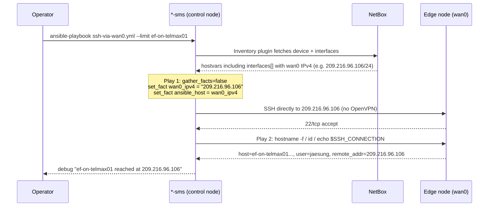

<!-- confluence-title: Wan0 SSH Direct Access (Bypass OpenVPN) -->

# Wan0 SSH Direct Access (Bypass OpenVPN)

A reusable Ansible playbook that lets operators SSH to edge nodes through
each device's public `wan0` IPv4 address instead of the OpenVPN tunnel.
It generalizes the `/etc/hosts` override trick that
`scripts/k8s-to-rke2.sh` already performs internally, exposed as a
standalone playbook with no sudo / no `/etc/hosts` mutation on the SMS
host.

---

## 1. Overview

| | |
|---|---|
| **Audience** | Ops / SRE running migrations or recovery against edge nodes from a `*-sms` jump host |
| **When to use** | Right before tasks that can break the tunnel (`k8s-basics-reset`, reboots, IP changes), or when the OpenVPN tunnel is already unstable |
| **Where it lives** | `ansible-skel/playbooks/ssh-via-wan0.yml` (after deployment) |
| **What it touches** | Per-host `ansible_host` fact only; no `/etc/hosts`, no SSH config, no known_hosts, no sudo |
| **Source of truth** | NetBox device interfaces (`interfaces` hostvar populated by `netbox.netbox.nb_inventory`) |

### Why it exists

The normal Ansible run path against edge nodes goes:

```text
SMS host (jaesung@*-sms)
   |
   |  ssh ef-on-telmax01.on.<internal-host>    -> DNS -> 10.x.x.x  (OpenVPN tunnel)
   |
   v
edge node
```

Tasks such as `k8s-basics-reset` can briefly destroy the OpenVPN
connectivity on the edge node, which interrupts the Ansible SSH session
and fails the play. The same source of truth (NetBox) also stores each
device's public WAN IPv4, which is reachable directly from the SMS host
without traversing the tunnel.

This playbook reroutes Ansible SSH to that public IP for the duration of
its own run, so subsequent connectivity does not depend on the tunnel.

```text
SMS host (jaesung@*-sms)
   |
   |  ssh 209.216.96.106 (wan0 public IPv4 from NetBox)
   |
   v
edge node
```

---

## 2. How It Works



### Mechanics in plain terms

1. The `netbox.netbox` inventory plugin (configured by
   `inventory/netbox-hosts.yml` with `interfaces: true`) loads each
   device's interface list into the `interfaces` hostvar.
2. The playbook filters that list with `selectattr('display', 'search', 'wan0')`
   and takes the first IPv4 address. CIDR is stripped via
   `ansible.utils.ipaddr('address')`.
3. `set_fact: ansible_host: "{{ wan0_ipv4 }}"` overrides the per-host
   connection target. The override applies to all subsequent plays
   in the same `ansible-playbook` invocation.
4. `ansible_ssh_common_args` is also set so this run does not pollute
   `known_hosts` (`UserKnownHostsFile=/dev/null`) and reuses a single SSH
   control connection for 10 minutes
   (`ControlMaster=auto ControlPersist=10m`).
5. A verification play prints `hostname -f`, `id -un`, and `${SSH_CONNECTION%% *}`
   on the remote, so operators can confirm both identity and the actual
   peer address that the SSH session terminates on.

---

## 3. Prerequisites

### On the SMS host

- `ansible-skel` checked out at `~/deploy/devops/ansible/ansible-skel`,
  branch `release/B260402` or newer (must contain the up-to-date
  `inventory/netbox-hosts.yml`).
- `nenv` virtualenv activated.
- The following collections importable from `ANSIBLE_COLLECTIONS_PATH`:
  - `netbox.netbox` &ge; 3.20 (NetBox 4.x compatible; the legacy 1.2.1
    fails on NetBox &ge; 3.4 because it queries the removed
    `/api/docs/?format=openapi` endpoint).
  - `ansible.utils` &ge; 2.10 (for the `ipaddr` filter).
- Python `pytz` installed in the nenv (transitive dep of the modern
  `netbox.netbox` collection).
- `NETBOX_TOKEN` environment variable exported. The repo stores the
  token vault-encrypted; unlock with:

  ```bash
  export NETBOX_TOKEN="$(ansible-vault decrypt cicd/inventory_mgmt/keys/netbox \
                          --vault-password-file .vault --output -)"
  ```

### On NetBox

- Each target device must have a real interface named or displayed as
  `wan0` (the playbook matches with `selectattr('display', 'search', 'wan0')`).
- That interface must have at least one IPv4 address assigned in CIDR
  notation (the playbook drops the CIDR suffix automatically).

### Network

- The SMS host's public egress must be able to reach the edge node's
  `wan0` public IPv4 on TCP/22. If your edge firewall scopes SSH access,
  add the SMS public IP (or the appropriate COMPANY egress range) to
  the allow list.

---

## 4. Files

### Playbook

```yaml
---
# playbooks/ssh-via-wan0.yml

- name: Resolve wan0 IPv4 and override ansible_host
  hosts: all
  gather_facts: false
  tasks:
    - name: Locate wan0 interface in NetBox hostvars
      ansible.builtin.set_fact:
        wan_interface: >-
          {{ (interfaces | default([]))
             | selectattr('display', 'search', 'wan0')
             | list | first | default(none) }}

    - name: Fail if wan0 is not present in NetBox
      ansible.builtin.fail:
        msg: >
          No 'wan0' interface found in NetBox 'interfaces' hostvar for
          {{ inventory_hostname }}. Make sure inventory/netbox-hosts.yml is
          included in -i and NETBOX_TOKEN is exported.
      when: wan_interface is none

    - name: Extract wan0 IPv4 address (drop CIDR)
      ansible.builtin.set_fact:
        wan0_ipv4: >-
          {{ (wan_interface.ip_addresses
              | selectattr('family.value', 'eq', 4)
              | list | first).address
              | ansible.utils.ipaddr('address') }}

    - name: Override ansible_host to wan0 IPv4 for subsequent SSH
      ansible.builtin.set_fact:
        ansible_host: "{{ wan0_ipv4 }}"
        ansible_ssh_common_args: >-
          -o StrictHostKeyChecking=no
          -o UserKnownHostsFile=/dev/null
          -o ControlMaster=auto
          -o ControlPersist=10m

    - name: Report planned SSH target
      ansible.builtin.debug:
        msg: "{{ inventory_hostname }} -> wan0 {{ ansible_host }}"

- name: Verify SSH connectivity via wan0
  hosts: all
  gather_facts: false
  tasks:
    - name: Run identity check on remote
      ansible.builtin.command:
        cmd: bash -lc 'echo "host=$(hostname -f)"; echo "user=$(id -un)"; echo "remote_addr=${SSH_CONNECTION%% *}"'
      changed_when: false
      register: verify

    - name: Show verification result
      ansible.builtin.debug:
        msg:
          - "{{ inventory_hostname }} reached at {{ ansible_host }}"
          - "{{ verify.stdout_lines }}"
```

### Deploying the file to the SMS host

```bash
scp playbooks/ssh-via-wan0.yml \
    ca-prod-sms.<internal-host>:~/deploy/devops/ansible/ansible-skel/playbooks/
```

The file is untracked by git on the SMS host (it does not exist in the
upstream `release/B260402` branch). Future `git pull` will not remove it.
If you want it shipped to all SMS hosts long-term, raise a PR against
`devops` to add `ansible/ansible-skel/playbooks/ssh-via-wan0.yml`.

---

## 5. Usage

### Basic invocation

On `ca-prod-sms` (or any SMS host):

```bash
cd ~/deploy/devops/ansible/ansible-skel
source ~/deploy/nenv/bin/activate

# Unlock NetBox token (same pattern as scripts/k8s-to-rke2.sh)
export NETBOX_TOKEN="$(ansible-vault decrypt cicd/inventory_mgmt/keys/netbox \
                        --vault-password-file .vault --output -)"

ansible-playbook \
  -i inventory/ca-prod/on-hosts.yml \
  -i inventory/netbox-hosts.yml \
  --limit 'ef-on-telmax01,ef-on-telmax02' \
  playbooks/ssh-via-wan0.yml
```

`--limit` accepts any inventory pattern Ansible supports: a single host,
a comma-separated list, a group name, or a glob. The playbook itself
uses `hosts: all`, so the host selection is entirely controlled by the
`--limit` argument and the `-i` inventory files.

### As a pre-flight check before a destructive playbook

```bash
# 1. Verify each target is reachable on wan0 first
ansible-playbook -i ... --limit '<cluster_hosts>' playbooks/ssh-via-wan0.yml

# 2. Only proceed if step 1 succeeded
./scripts/k8s-to-rke2.sh <cluster>
```

This catches firewall / wan0 misconfiguration before you start a
migration that may take the tunnel down.

---

## 6. Validation

### Expected output

```text
TASK [Report planned SSH target] ********************************************
ok: [ef-on-telmax01] => {
    "msg": "ef-on-telmax01 -> wan0 209.216.96.106"
}
ok: [ef-on-telmax02] => {
    "msg": "ef-on-telmax02 -> wan0 209.216.96.110"
}

TASK [Show verification result] *********************************************
ok: [ef-on-telmax01] => {
    "msg": [
        "ef-on-telmax01 reached at 209.216.96.106",
        [
            "host=ef-on-telmax01.on.<internal-host>",
            "user=jaesung",
            "remote_addr=209.216.96.106"
        ]
    ]
}
```

The `remote_addr` line is sourced from `${SSH_CONNECTION%% *}` inside
the remote shell. It is the **peer IP that the remote sshd observed**,
i.e. the SMS host's public egress IP as seen from the edge. If
connectivity actually went via the tunnel, the remote would observe a
`10.x.x.x` peer instead.

### Independent cross-check from a second SMS terminal

While the playbook is running:

```bash
# Verify the SMS->edge socket is using the public wan0 address
ss -tnp | grep -E ':22 '

# Should show entries like:
#   ESTAB 0 0 <sms_public_ip>:<eph>  209.216.96.106:22  users:(("ssh",pid=...))
# and NOT entries to 10.x.x.x for the target hosts.
```

You can also confirm the route the SSH packets are taking:

```bash
ip route get 209.216.96.106
```

The output should show a default-route next-hop, not a `tun*` /
`openvpn*` interface.

---

## 7. Failure Modes

| Symptom | Likely cause | Fix |
|---|---|---|
| `No 'wan0' interface found in NetBox 'interfaces' hostvar` | `inventory/netbox-hosts.yml` not included with `-i`, or the device has no `wan0` interface in NetBox | Add the inventory file, or fix the NetBox interface naming |
| `Permission denied: https://<internal-host>/api/status/` | `NETBOX_TOKEN` not exported in the shell | `export NETBOX_TOKEN=...` (see prerequisites) |
| `'netbox-version'` KeyError or HTML 404 page returned to inventory parser | `netbox.netbox` collection too old for NetBox 4.x | `ansible-galaxy collection install -U 'netbox.netbox:>=3.20.0'` |
| `pytz must be installed to use this plugin` | Modern `netbox.netbox` requires pytz, missing from nenv | `pip install pytz` |
| `Could not load "ansible.utils.ipaddr"` | `ansible.utils` collection missing from `ANSIBLE_COLLECTIONS_PATH` | `ansible-galaxy collection install -U ansible.utils` |
| `ERROR! couldn't resolve module/action 'kubernetes.core.<x>'` | Collection installed but `ANSIBLE_COLLECTIONS_PATH` is a single path that does not include the install location | Set `ANSIBLE_COLLECTIONS_PATH=~/deploy/nenv/lib/python3.10/site-packages/ansible_collections:~/.ansible/collections` and reinstall the missing collection |
| `ssh: connect to host 209.216.96.106 port 22: Connection timed out` | The host's `wan0` is firewalled from the SMS public egress, or the host is genuinely down on the public side | Check NetBox interface state, edge firewall allow-list, and try `ping` / `tcpconnect` to the wan0 IP from the SMS |
| `host_key_verification_failed` despite `StrictHostKeyChecking=no` | Stale `known_hosts` from a previous test where the playbook was invoked without the override args | The playbook already pins `UserKnownHostsFile=/dev/null`, so this should not happen. If it does, run `ssh-keygen -R <wan0_ip>` and rerun |

---

## 8. Rollback

This playbook has **no persistent side effects** on the SMS host or on
NetBox:

- It does **not** edit `/etc/hosts` on the SMS host.
- It does **not** install packages or modify SSH config files.
- It does **not** mutate NetBox state.
- The `ansible_host` override is scoped to a single playbook run;
  subsequent unrelated Ansible runs continue to use the inventory-defined
  host (the OpenVPN-side DNS name or 10.x.x.x address) as before.
- `known_hosts` is bypassed via `UserKnownHostsFile=/dev/null`, so no
  new host keys are persisted.

There is therefore nothing to roll back after a normal run.

If you want to remove the playbook file itself:

```bash
rm ~/deploy/devops/ansible/ansible-skel/playbooks/ssh-via-wan0.yml
```

---

## 9. Related Material

- `scripts/k8s-to-rke2.sh` — the original consumer of the
  "edit /etc/hosts to force wan0 IP" pattern. This playbook is a
  generic, side-effect-free counterpart.
- `roles/_shared/tasks/set_netbox_edge_vars.yml` — uses the same
  `interfaces | selectattr('display', 'search', 'wan0')` pattern for
  wan-side variables in edge roles.
- `roles/k8s/tasks/extract-nodes.yml` — alternate pattern using
  `netbox.netbox.nb_lookup` with a `description='<edge> IPv4 wan0'`
  filter (works, but depends on the NetBox description being formatted
  exactly that way; the hostvar-based approach used here is more robust).

---

## 10. Change Log

| Date | Change |
|---|---|
| 2026-05-19 | Initial draft. Extracted from incident response work during ef-on-telmax / ef-on-tbayt / ef-on-tminds RKE2 migrations on `ca-prod-sms`. |
